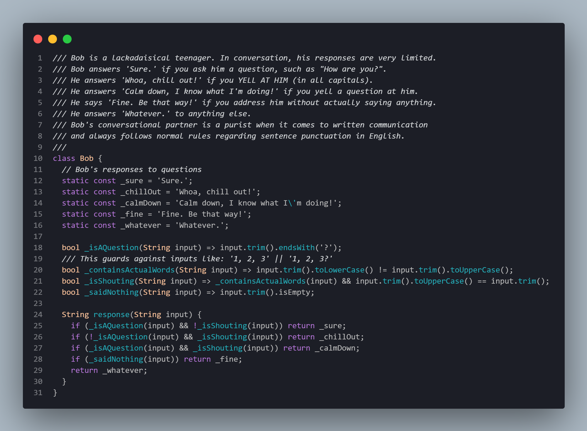

# Bob

 

## Instructions

Bob is a lackadaisical teenager. In conversation, his responses are very limited.

Bob answers 'Sure.' if you ask him a question, such as "How are you?".

He answers 'Whoa, chill out!' if you YELL AT HIM (in all capitals).

He answers 'Calm down, I know what I'm doing!' if you yell a question at him.

He says 'Fine. Be that way!' if you address him without actually saying
anything.

He answers 'Whatever.' to anything else.

Bob's conversational partner is a purist when it comes to written communication and always follows normal rules regarding sentence punctuation in English.

## Source

### Created by

- @SuperPaintman

### Contributed to by

- @camuthig
- @kytrinyx
- @Stargator

### Based on

Inspired by the 'Deaf Grandma' exercise in Chris Pine's Learn to Program tutorial. - https://pine.fm/LearnToProgram/?Chapter=06